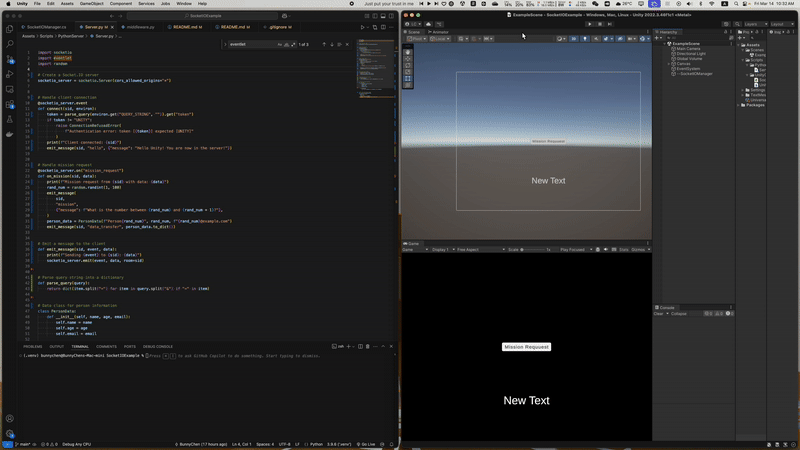
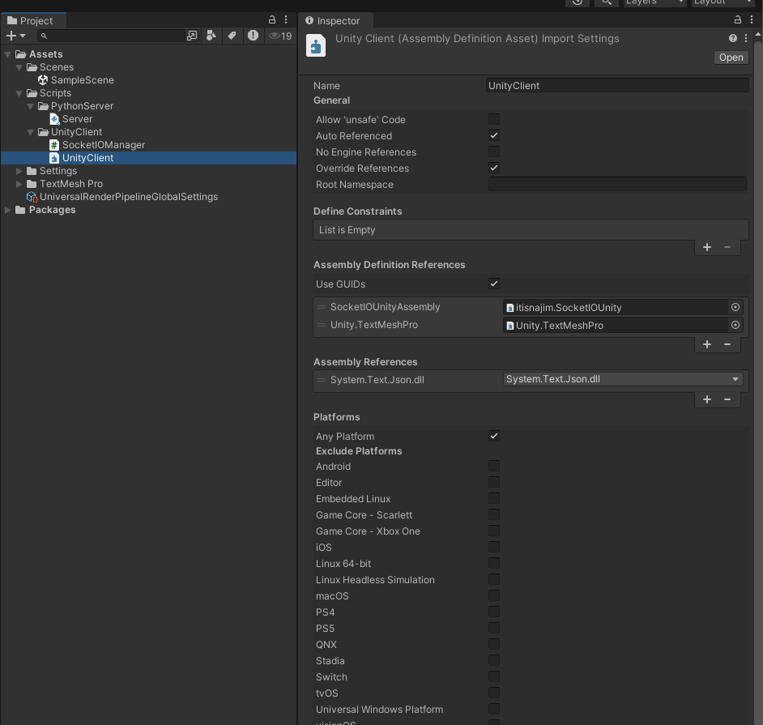

# Unity SocketIO Example

> A Simple Unity Socket IO Example

## Install the package

You need to first install the Unity package from the package manager: [itisnajim/SocketIOUnity: A Wrapper for socket.io-client-csharp to work with Unity.](https://github.com/itisnajim/SocketIOUnity). The link is: `https://github.com/itisnajim/SocketIOUnity`.

In Unity, open Window -> Package Manager -> and click (+) add package from git URL... and paste it there.

## Setup the Unity Reference

This is already set up in this project, but for your new project, you may get an error about `Text.Json` missing. Just create an assembly reference as shown in the image below:

## Create the Python Environment

You must have Python installed on your computer/server to run SocketIO. I suggest creating a virtual environment first, then installing the pip packages. The package list is in [this file](requirements.txt).

## Run the Demo ！

Run the [python scripts](Assets/Scripts/PythonServer/Server.py) to start the server, and then run the Unity **ExampleScene**. Click the button to send a message to the server.
